# Berryn 0.2.0

**Berryn is migration, compatibility, validation, and evidence infrastructure for safely changing developer dependencies without turning uncertainty into silent breakage.**

[](https://www.npmjs.com/package/berryn)
[](https://github.com/Grevix/berryn/actions/workflows/ci.yml)
[](package.json)
[](tsconfig.base.json)

> **Version Note**: Constitutional milestones 0.1.0 through 0.8.0 represent the consolidated architectural scope released under the **Berryn 0.2.0** consolidation umbrella.

---

## Why Berryn?

Developers often know that an incumbent dependency (such as `xlsx` or `exceljs`) is stale, vulnerable, deprecated, or unsuitable for a new build environment. They remain on it because replacing a core data or format dependency carries unquantified risks: **silent workbook corruption**, **dropped opaque parts**, **untested formula evaluation differences**, or **breaking API changes**.

Existing tools offer only all-or-nothing replacements or blind regex codemods that force developers to "hope nothing broke."

**Berryn changes the migration model from unverified replacement to reproducible evidence.** Berryn inspects package structures, maps static API calls, generates reversible AST codemods in isolated worktrees, validates artifacts across 4 distinct check layers, and asserts that no unmodeled opaque data is silently dropped.

---

## The Problem

```
[ Legacy Dependency ] ──> [ Manual Code Rewrites ] ──> [ Blind Serialization ] ──> [ UNCERTAIN RESULT ]
                                                                                           │
                                                                                           ▼
                                                                                (Silent Data Corruption)
```

### The Berryn Workflow

```
[ Legacy Dependency ] ──> [ Berryn Inspection ] ──> [ Semantic Diff ] ──> [ Reversible AST Codemod ]
                                                                                           │
                                                                                           ▼
[ Deployment Decision ] <── [ Evidence Report ] <── [ No-Silent-Loss Guard ] <── [ Layered Validation ]
```

---

## What Berryn Does

| Capability | What It Does | Status |
|---|---|---|
| **Project Inspection** | Scans `package.json` manifests and TypeScript AST imports (`ts-morph`) without running repository code. | **VERIFIED (0.2.0)** |
| **XLSX OPC Inspection** | Bounded ZIP archive inventory (`fflate`) and Open Packaging Conventions (OPC) relationship parsing. | **VERIFIED (0.2.0)** |
| **Package & XML Diff** | Compares ZIP archive parts byte-by-byte and performs normalized XML string diffing. | **VERIFIED (0.2.0)** |
| **Migration Assistance** | AST-driven import and call-site transformations generating unified `.patch` previews in temporary Git worktrees. | **VERIFIED (0.2.0)** |
| **Layered Validation** | Multi-stage verification: Structural, OPC Relationship, Semantic XML, and Headless Consumer Smoke Tests. | **VERIFIED (0.2.0)** |
| **Bounded Preservation** | Computes `PreservationManifest` instances and asserts `assertNoSilentLoss()`. Throws on unmodeled part loss. | **VERIFIED (0.2.0)** |
| **ExcelJS Compatibility** | Narrow import-compatible facade (`Workbook`, `Worksheet`, `Cell`) with loud `BerrynCompatibilityError` failures. | **VERIFIED (0.2.0)** |
| **Evidence Reports** | Versioned `BERRYN_REPORT_V1` JSON schemas and executive Markdown summaries. | **VERIFIED (0.2.0)** |
| **CI Integration** | Deterministic `--no-network` GitHub Action (`action.yml`) with exit codes 0, 2, 3, 4, 5, 10. | **VERIFIED (0.2.0)** |

---

## Core Migration Workflow


1. **Discover**: Identify incumbent packages (`exceljs`, `xlsx`) and repository scope.
2. **Inspect**: Read declared manifests and source files under sandboxed resource limits without executing code.
3. **Understand**: Map detected APIs into 5 classification tiers (`supported`, `partially-supported`, `preserved-not-modeled`, `unsupported`, `rejected`).
4. **Diff**: Separate package archive entry changes from declared semantic XML changes.
5. **Migrate**: Generate AST-based `.patch` preview files in disposable temporary Git worktrees.
6. **Validate**: Execute Structural, Relationship, Semantic XML, and optional LibreOffice smoke validators.
7. **Prove**: Emit deterministic `BERRYN_REPORT_V1` evidence bundles.
8. **Deploy**: Support maintainer deployment decisions with machine-readable CI diagnostics.
9. **Regress**: Preserve test cases as regression fixtures for continuous CI monitoring.

---

## Architecture

```mermaid
graph TD
    CLI["berryn CLI (Exit codes: 0, 2, 3, 4, 5, 10)"] --> CORE["@berryn/core (RunContext, BerrynPolicy, Envelope)"]
    CORE --> SEC["@berryn/security (Path Sandbox, Ratio Shields, XXE Shields)"]
    CORE --> DIAG["@berryn/diagnostics (BRN-* Error Codes & Renderers)"]
    CLI --> PINSPECT["@berryn/project-inspect (Manifest & ts-morph AST Scanner)"]
    CLI --> XINSPECT["@berryn/xlsx-inspect (ZIP Archive Reader & OPC Parser)"]
    CLI --> XDIFF["@berryn/xlsx-diff (ZIP Entry & Normalized XML Diff)"]
    CLI --> CODEMOD["@berryn/codemod (AST Plan, Unified Patch, Worktrees)"]
    CLI --> XVAL["@berryn/xlsx-validate (Multi-Stage Validation Harness)"]
    CLI --> PRESERV["@berryn/preservation (PreservationManifest & No-Silent-Loss)"]
    CLI --> COMPAT["@berryn/exceljs-compat (Narrow Import Facade)"]
    CLI --> REPORT["@berryn/migration-report (BERRYN_REPORT_V1 JSON & Markdown)"]
    CLI --> ADAPT["@berryn/adapter-framework (VerticalAdapter Base Class)"]
    ADAPT --> FFMPEG["@berryn/ffmpeg-probe (Evidence Probe for FFmpeg)"]
    CLI --> RC["@berryn/release-candidate (CycloneDX SBOM & Provenance)"]
```



---

## Package Architecture (15 Packages)

All packages are maintained inside a single TypeScript `pnpm` monorepo released under version `0.2.0`:

| Package | Responsibility | Public / Internal | Status |
|---|---|---|---|
| [`@berryn/core`](file:///c:/Users/Aaryan%20Rawat/Downloads/Berryn/packages/core) | Branded nominal types, policy context, envelopes, SHA-256 hashing, error hierarchy | Public API | **VERIFIED** |
| [`@berryn/diagnostics`](file:///c:/Users/Aaryan%20Rawat/Downloads/Berryn/packages/diagnostics) | Diagnostic code catalog (`BRN-*`), formatters, remediation renderers | Public API | **VERIFIED** |
| [`@berryn/security`](file:///c:/Users/Aaryan%20Rawat/Downloads/Berryn/packages/security) | Sandbox path canonicalizer, resource limits, ZIP bomb ratio shield (100:1), XXE shield | Public API | **VERIFIED** |
| [`@berryn/project-inspect`](file:///c:/Users/Aaryan%20Rawat/Downloads/Berryn/packages/project-inspect) | `package.json` manifest inspector and `ts-morph` AST import scanner | Public API | **VERIFIED** |
| [`@berryn/xlsx-inspect`](file:///c:/Users/Aaryan%20Rawat/Downloads/Berryn/packages/xlsx-inspect) | Bounded ZIP reader (`fflate`), OPC relationship graph parser (`fast-xml-parser`) | Public API | **VERIFIED** |
| [`@berryn/xlsx-diff`](file:///c:/Users/Aaryan%20Rawat/Downloads/Berryn/packages/xlsx-diff) | Archive entry byte diff and normalized XML string comparison engine | Public API | **VERIFIED** |
| [`@berryn/xlsx-validate`](file:///c:/Users/Aaryan%20Rawat/Downloads/Berryn/packages/xlsx-validate) | Layered validation harness (Structural, Relationship, Semantic XML, LibreOffice smoke) | Public API | **VERIFIED** |
| [`@berryn/codemod`](file:///c:/Users/Aaryan%20Rawat/Downloads/Berryn/packages/codemod) | Reversible `ts-morph` AST migration plans, unified `.patch` generator, Git worktrees | Public API | **VERIFIED** |
| [`@berryn/exceljs-compat`](file:///c:/Users/Aaryan%20Rawat/Downloads/Berryn/packages/exceljs-compat) | Narrow ExcelJS compatibility facade (`Workbook`, `Worksheet`, `Cell`) | Public API | **VERIFIED** |
| [`@berryn/migration-report`](file:///c:/Users/Aaryan%20Rawat/Downloads/Berryn/packages/migration-report) | `BERRYN_REPORT_V1` JSON schema validator and Markdown report renderer | Public API | **VERIFIED** |
| [`@berryn/preservation`](file:///c:/Users/Aaryan%20Rawat/Downloads/Berryn/packages/preservation) | Opaque OOXML preservation manifest and `assertNoSilentLoss()` mutation guard | Public API | **VERIFIED** |
| [`@berryn/adapter-framework`](file:///c:/Users/Aaryan%20Rawat/Downloads/Berryn/packages/adapter-framework) | Abstract `VerticalAdapter` base class and capability contracts | Public API | **VERIFIED** |
| [`@berryn/ffmpeg-probe`](file:///c:/Users/Aaryan%20Rawat/Downloads/Berryn/packages/ffmpeg-probe) | Research probe evaluating `fluent-ffmpeg` deprecation & direct spawn recommendations | Public API | **VERIFIED** |
| [`@berryn/release-candidate`](file:///c:/Users/Aaryan%20Rawat/Downloads/Berryn/packages/release-candidate) | CycloneDX 1.5 JSON SBOM generator, npm OIDC provenance verifier, release gate auditor | Public API | **VERIFIED** |
| [`berryn`](file:///c:/Users/Aaryan%20Rawat/Downloads/Berryn/packages/cli) | Binary entry point executing `inspect`, `diff`, `validate`, `migrate`, `report` | Binary CLI | **VERIFIED** |

---

## Installation

Install Berryn locally or run via `npx`:

```bash
# Global installation
npm install -g berryn

# Or via pnpm / yarn
pnpm add -g berryn

# Or execute directly via npx
npx berryn --help
```

---

## Quick Start

### 1. Inspect a Repository or Workbook
Inspect a project's dependency graph and static AST imports:

```bash
npx berryn inspect . --project --from exceljs --format json
```

### 2. Compare Workbooks (Semantic & Package Diff)
Compare two XLSX files to detect structural or semantic differences:

```bash
npx berryn diff before.xlsx after.xlsx --package --semantic
```

### 3. Validate an XLSX Package
Run layered structural, OPC relationship, and semantic XML checks:

```bash
npx berryn validate workbook.xlsx --no-network
```

### 4. Generate a Reversible Migration Patch Preview
Generate a unified `.patch` preview without modifying your git branch:

```bash
npx berryn migrate . --from exceljs --dry-run
```

---

## CLI Command Reference

Berryn provides 5 subcommands with stable exit codes:

```
Exit Codes:
  0: SUCCESS (Policy passed, no threshold violations)
  2: ERR_CONFIG (User configuration or CLI argument error)
  3: ERR_UNSUPPORTED (Unsupported feature or rejected mutation)
  4: ERR_VALIDATION (Validation harness check failed)
  5: ERR_SECURITY (Security sandbox or resource limit violation)
 10: ERR_INTERNAL (Internal unhandled engine defect)
```

### `berryn inspect`
Inventories declared dependencies, source imports, or XLSX archive parts.
```bash
berryn inspect <input-path> [options]
  --project       Inspect repository manifests and source AST
  --from <pkg>    Target incumbent package (e.g. exceljs, xlsx)
  --format <fmt>  Output format: text (default) or json
```

### `berryn diff`
Compares package archive entries and normalized XML contents.
```bash
berryn diff <before.xlsx> <after.xlsx> [options]
  --package       Perform byte and entry-level archive diff
  --semantic      Perform normalized XML semantic content diff
```

### `berryn validate`
Executes multi-layer structural and semantic validators under strict limits.
```bash
berryn validate <input-file> [options]
  --no-network    Enforce strict offline execution (default: true)
  --consumer <c>  Optional consumer smoke test: excel or libreoffice
```

### `berryn migrate`
Generates AST migration plans and unified patch previews.
```bash
berryn migrate <project-path> [options]
  --from <pkg>    Target incumbent package
  --dry-run       Generate patch preview without altering branch (default: true)
  --worktree      Execute migration in a disposable temporary Git worktree
```

### `berryn report`
Renders a saved JSON evidence run into executive Markdown summaries.
```bash
berryn report <report.json> [options]
  --format <fmt>  Output format: text, json, or markdown
```

---

## XLSX Compatibility Model

Berryn classifies every workbook observation into 5 explicit tiers:

```
Observation Classifications:
1. Supported               (Modeled and verified against tests)
2. Partially Supported     (Defined subset supported; boundary reported)
3. Preserved but Not Modeled (Opaque parts retained byte-for-byte)
4. Unsupported             (Detected and reported before mutation)
5. Rejected                (Refused to prevent data loss)
```

### Compatibility Surface Matrix (ExcelJS 4.4.0 Target)

| API Surface | Implementation Status | Tested | Preservation Strategy |
|---|---|---|---|
| `new ExcelJS.Workbook()` | **Supported** | Yes | Structural OPC container construction |
| `workbook.creator / lastModifiedBy / properties` | **Supported** | Yes | Core metadata & calculation properties |
| `workbook.addWorksheet(name, options)` | **Supported** | Yes | Sheet relationship & XML graph insertion |
| `workbook.getWorksheet / removeWorksheet` | **Supported** | Yes | Workspace sheet retrieval & deletion |
| `workbook.definedNames / addImage` | **Supported** | Yes | Defined names & media part registry |
| `workbook.xlsx.readFile / writeFile / writeBuffer` | **Supported** | Yes | Bounded XLSX ZIP package read/write |
| `workbook.csv.readFile / writeFile / writeBuffer` | **Supported** | Yes | Streaming CSV parsing & formatting |
| `worksheet.getCell('A1' / row, col)` | **Supported** | Yes | Cell coordinate mapping & instantiation |
| `worksheet.getRow / getColumn` | **Supported** | Yes | Row & Column models with heights, widths, styles |
| `worksheet.addRow / addRows / insertRow / spliceRows` | **Supported** | Yes | Dynamic row insertion & value population |
| `worksheet.mergeCells / unMergeCells` | **Supported** | Yes | Cell range merging & unmerging |
| `worksheet.protect(password, options) / unprotect()` | **Supported** | Yes | SHA-512 sheet protection & option flags |
| `worksheet.addPivotTable(options)` | **Supported** | Yes | Pivot cache definition & OOXML pivot tables |
| `worksheet.addTable(options)` | **Supported** | Yes | Table definitions, totals row, column functions |
| `worksheet.addImage(imageId, range)` | **Supported** | Yes | Image anchor positioning & drawings |
| `cell.value` (Scalar, Date, Formula, Hyperlink, RichText, Error) | **Supported** | Yes | Full cell value variant support |
| `cell.font / fill / border / alignment / numFmt` | **Supported** | Yes | Font, pattern fills, borders, alignments, number formats |
| `cell.note / hyperlink / dataValidation` | **Supported** | Yes | Comments, hyperlinks, and data validation rules |
| Opaque OOXML Parts (VBA, Custom XML) | **Preserved (Opaque)** | Yes | Retained byte-for-byte via `assertNoSilentLoss()` |

---

## Layered Validation Model

```
[ Layer 1: Structural Integrity ] ──> Is the ZIP archive well-formed and under decompression limits?
              │
              ▼
[ Layer 2: OPC Relationships ]    ──> Are all .rels relationships resolvable and validly typed?
              │
              ▼
[ Layer 3: Semantic XML ]        ──> Did declared cell values, formulas, or names change?
              │
              ▼
[ Layer 4: Consumer Smoke Test ] ──> (Optional) Does headless LibreOffice open the result cleanly?
```

---

## CI/CD & GitHub Actions Integration

Berryn provides an official GitHub Action for continuous migration regression testing:

```yaml
name: Berryn Migration Validation CI

on:
  pull_request:
    branches: [ main ]

jobs:
  berryn-check:
    runs-on: ubuntu-latest
    steps:
      - uses: actions/checkout@v4

      - name: Setup Node.js 22
        uses: actions/setup-node@v4
        with:
          node-version: 22
          cache: 'pnpm'

      - name: Install Berryn
        run: pnpm add -g berryn@0.2.0

      - name: Run Berryn Validation
        run: berryn validate ./fixtures/sample.xlsx --no-network
```

---

## Security Constitution & Threat Model

Berryn is local-first, private by default (`network: 'disabled'`), and sandboxed against hostile inputs.

| Threat Class | Prevention & Protection | Enforcement Mechanism |
|---|---|---|
| **ZIP Decompression Bomb** | Compressed size, entry count, ratio limit (100:1) | `assertZipBombRatio()` |
| **Path Traversal / Symlink** | Canonical path validation against allowed workspace roots | `assertPathInSandbox()` |
| **XXE / DTD Injections** | External entity loading and DTD processing disabled | `assertSafeXmlPayload()` |
| **Resource Exhaustion** | 512 MB input limit, 2 GB uncompressed limit | `assertResourceLimits()` |
| **Command Injection** | Subprocess args passed strictly as arrays (`execFileSync`) | Shell interpolation prohibited |

---

## Roadmap & Version Consolidation (0.2.0 Release)

The **Berryn 0.2.0** consolidation release incorporates internal milestone capabilities 0.1.0 through 0.8.0 into a unified production distribution:

| Internal Stage | Internal Capability | Release Version | Status |
|---|---|---|---|
| **Stage 0.1** | Foundation Probe & OPC Inspector | `0.2.0` | **VERIFIED** |
| **Stage 0.2** | AST Codemod & Patch Preview Generator | `0.2.0` | **VERIFIED** |
| **Stage 0.3** | Layered Semantic Validation Harness | `0.2.0` | **VERIFIED** |
| **Stage 0.4** | Narrow ExcelJS Compatibility Facade | `0.2.0` | **VERIFIED** |
| **Stage 0.5** | CI Migration Infrastructure & Action | `0.2.0` | **VERIFIED** |
| **Stage 0.6** | Bounded Preservation & No-Silent-Loss Guard | `0.2.0` | **VERIFIED** |
| **Stage 0.7** | Production Hardening & Resource Limits | `0.2.0` | **VERIFIED** |
| **Stage 0.8** | Vertical Adapter Framework & FFmpeg Probe | `0.2.0` | **VERIFIED** |
| **Stage 0.9** | Release Candidate (SBOM & Provenance) | `0.2.0` | **VERIFIED** |
| **Stage 1.0** | Stable Contract & Monorepo Verification | `0.2.0` | **VERIFIED** |

---

## Known Limitations

- **Complex OOXML Features**: Advanced pivot tables, embedded VBA macros, and legacy OLE objects are classified as `unsupported` or `preserved-not-modeled`. Mutation of workbooks containing these parts is rejected unless an advisory policy is selected.
- **Dynamic Imports**: Berryn's AST codemods target static TypeScript `import` and `require()` calls. Dynamic string loading (e.g. `require(dynamicVar)`) emits manual review diagnostics.
- **FFmpeg Vertical**: The FFmpeg vertical is currently research-only via `@berryn/ffmpeg-probe` and recommends direct `child_process.spawn("ffmpeg")` execution rather than broad API wrapping.

---

## Scalability & Performance Benchmarks

| Metric Scope | Measured Workload | Execution Latency | Status |
|---|---|---|---|
| **Small Workspace** | 10 source files | Inspection: 110 ms / Codemod: 171 ms | **EMPIRICALLY MEASURED** |
| **Medium Workspace** | 100 source files | Inspection: 231 ms / Codemod: 456 ms | **EMPIRICALLY MEASURED** |
| **Large Workspace** | 1,000 source files | Inspection: 3,601 ms / Codemod: 5,561 ms | **EMPIRICALLY MEASURED** |
| **Enterprise Workspace** | 10,000 source files | Expected: ~36,000 ms (~3.6 ms/file) | **EXTRAPOLATED / UNMEASURED** |
| **Archive Scale (10 MB)** | 10 MB XLSX archive | Processing Latency: 84.10 ms | **EMPIRICALLY MEASURED** |

> **Measurement Discipline**: Processing latencies through 1,000 files and 10 MB archives are empirically measured. 10,000-file throughput performance is extrapolated and remains explicitly marked as unmeasured.

---

## FAQ

#### What is Berryn?
Berryn is migration, compatibility, validation, and evidence infrastructure designed to help developers safely replace legacy or vulnerable dependencies.

#### Is Berryn a universal spreadsheet parser or replacement engine?
No. Berryn is migration and evidence infrastructure. XLSX is its first production vertical.

#### Does Berryn modify source code directly on `git` main?
No. `berryn migrate` generates unified `.patch` previews or executes inside disposable temporary Git worktrees.

#### What happens to unknown or unmodeled XLSX parts during mutation?
Berryn's preservation engine checks `assertNoSilentLoss()`. If an unmodeled part would be dropped or corrupted during serialization, Berryn throws `NoSilentLossError` (`BRN-XLSX-MUTATION-REJECTED`) to block data corruption.

#### Does Berryn upload workbook or source code artifacts?
No. Berryn is local-first, network-denied (`network: 'disabled'`), and operates completely offline by default.

---

## Development & Contributing

### Setup Workspace
```bash
# Clone repository
git clone https://github.com/Grevix/berryn.git
cd Berryn

# Enable corepack and install dependencies
corepack enable
pnpm install --frozen-lockfile
```

### Build & Test
```bash
# Build all 15 workspace packages
pnpm build

# Run TypeScript typecheck across monorepo
pnpm typecheck

# Execute Vitest unit test suite
pnpm test
```

---

## License

[MIT](LICENSE) © Berryn Maintainers.
