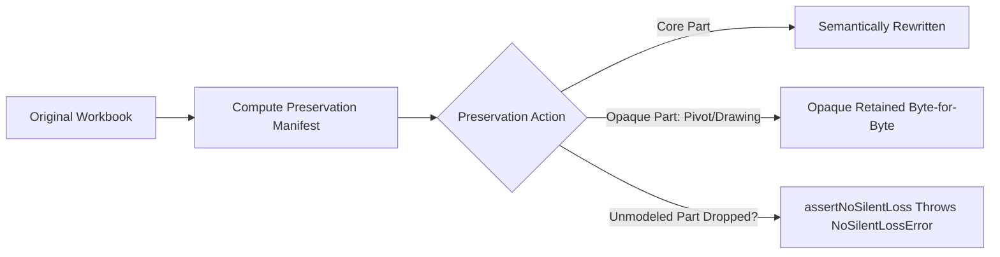

# @berryn/preservation

> **Opaque OOXML part preservation manifest and `assertNoSilentLoss()` mutation safety guard.**

[](https://www.npmjs.com/package/@berryn/preservation)
[](https://opensource.org/licenses/MIT)
[](https://nodejs.org)
[](https://www.typescriptlang.org/)

---

## Overview

A critical flaw in legacy spreadsheet libraries (such as older versions of SheetJS/`xlsx` or `exceljs`) is the silent deletion of unmodeled OOXML parts. When a library opens a workbook containing pivot tables, VBA macros, embedded vector drawings, custom XML parts, or chart sheets, it frequently discards them upon re-serialization without warning the user.

`@berryn/preservation` establishes an immutable contract: **No Silent Data Loss**. It tracks all container parts via a `PreservationManifest` and enforces strict invariants with `assertNoSilentLoss()`. If a mutation drops an unmodeled opaque part, Berryn aborts and throws an explicit error rather than producing corrupted files.

---

## Installation

```bash
# Using pnpm
pnpm add @berryn/preservation

# Using npm
npm install @berryn/preservation
```

---

## How It Works



1. **Manifest Computation (`computePreservationManifest`)**: Inventories all parts within the source container and determines the preservation action (`byte-preserved`, `semantically-rewritten`, `opaque-retained`, `dropped-rejected`).
2. **Mutation Guard (`assertNoSilentLoss`)**: Compares before/after manifests. If any `opaque-retained` part (e.g. chart, pivot table, drawing) is missing from the output manifest, it throws `NoSilentLossError` (`BRN-XLSX-004`).

---

## Usage Examples

### 1. Computing a Preservation Manifest

```typescript
import { readFileSync } from 'node:fs';
import { inspectXlsx } from '@berryn/xlsx-inspect';
import { computePreservationManifest } from '@berryn/preservation';

const buffer = readFileSync('template_with_charts.xlsx');
const { value: inspectionReport } = inspectXlsx(buffer);

const manifest = computePreservationManifest(inspectionReport);

console.log(`Total Parts: ${manifest.totalParts}`);
console.log(`Preserved Count: ${manifest.preservedPartCount}`);
console.log(`Unmodeled Opaque Count: ${manifest.unmodeledOpaqueCount}`);

for (const part of manifest.parts) {
  console.log(`${part.partPath}: [${part.preservationAction}]`);
}
```

---

### 2. Guarding Mutations with `assertNoSilentLoss`

```typescript
import { computePreservationManifest, assertNoSilentLoss, NoSilentLossError } from '@berryn/preservation';

const beforeManifest = computePreservationManifest(beforeReport);
const afterManifest = computePreservationManifest(afterReport);

try {
  // Asserts that no opaque-retained parts were dropped
  assertNoSilentLoss(beforeManifest, afterManifest);
  console.log('Preservation check clean: Zero silent data loss.');
} catch (err) {
  if (err instanceof NoSilentLossError) {
    console.error('MUTATION BLOCKED:', err.message);
  }
}
```

---

## Exported Symbols

| Symbol | Category | Description |
|---|---|---|
| `computePreservationManifest` | Function | Generates a manifest classifying all parts into retention states. |
| `assertNoSilentLoss` | Function | Compares before and after manifests, throwing if opaque parts were dropped. |
| `NoSilentLossError` | Class | Error thrown upon violation with attached `BRN-XLSX-004` diagnostic. |
| `PreservationManifest` | Interface | Schema containing manifest ID, part counts, and preservation state list. |
| `PartPreservationState` | Interface | Per-part retention descriptor (`partPath`, `contentType`, `preservationAction`, `originalHash`). |

---

## Links

- **Repository**: [https://github.com/Grevix/berryn](https://github.com/Grevix/berryn)
- **License**: [MIT](https://opensource.org/licenses/MIT) © 2026 Berryn Core Engineering Team
