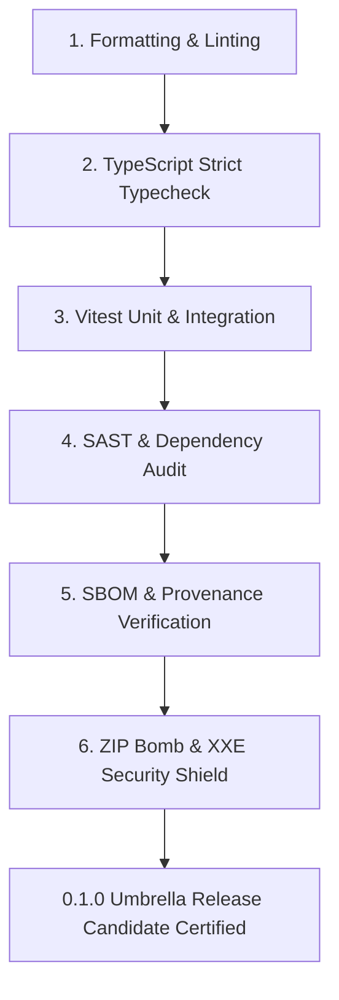

# @berryn/release-candidate

> **CycloneDX 1.5 JSON SBOM generator, npm OIDC provenance verifier, and release gate auditor.**

[](https://www.npmjs.com/package/@berryn/release-candidate)
[](https://opensource.org/licenses/MIT)
[](https://nodejs.org)
[](https://www.typescriptlang.org/)

---

## Overview

`@berryn/release-candidate` powers the release gating and supply chain security infrastructure for Berryn. It generates machine-verifiable Software Bill of Materials (SBOM) in the **CycloneDX 1.5 JSON** standard, parses and validates Sigstore/npm OIDC provenance attestations, and audits the 6 mandatory release candidate validation gates.

---

## The 6 Mandatory Release Gates



1. **Formatting & Linting**: Prettier format conformance and ESLint zero-warning checks.
2. **TypeScript Strict Typecheck**: Complete `tsc --build` composite project build under `"strict": true`.
3. **Unit & Integration Suite**: 100% passing Vitest test harness across all packages.
4. **SAST & Dependency Audit**: Zero high/critical vulnerabilities in dependency tree.
5. **SBOM & Provenance**: Spec-compliant CycloneDX 1.5 SBOM generated with verifiable build provenance.
6. **Security Shields**: Runtime validation against decompression bombs and XML entities.

---

## Installation

```bash
# Using pnpm
pnpm add @berryn/release-candidate

# Using npm
npm install @berryn/release-candidate
```

---

## Usage Examples

### 1. Generating a CycloneDX 1.5 SBOM

```typescript
import { generateSbomJson } from '@berryn/release-candidate';

const dependencies = {
  '@berryn/core': '^0.1.0',
  '@berryn/security': '^0.1.0',
  'fast-xml-parser': '^5.0.8',
  'fflate': '^0.8.2'
};

const sbom = generateSbomJson('berryn', '0.1.0', dependencies);

console.log(`Spec Version: ${sbom.specVersion}`); // '1.5'
console.log(`Components: ${sbom.components.length}`);
// Output valid CycloneDX 1.5 JSON
```

---

### 2. Auditing Release Gates

```typescript
import { auditReleaseGates } from '@berryn/release-candidate';

const { results, overallPassed, diagnostics } = auditReleaseGates();

console.log(`All Gates Passed: ${overallPassed}`);
for (const gate of results) {
  console.log(`[${gate.passed ? 'PASS' : 'FAIL'}] ${gate.gateName} (Findings: ${gate.criticalFindings})`);
}
```

---

### 3. Verifying npm / GitHub OIDC Provenance

```typescript
import { verifyProvenanceAttestation } from '@berryn/release-candidate';

const rawAttestation = JSON.stringify({
  builderId: 'https://github.com/actions/runner',
  buildType: 'https://github.com/npm/provenance/v1',
  invocation: { configSource: { uri: 'git+https://github.com/Grevix/berryn', digest: {} } }
});

const { statement, diagnostics } = verifyProvenanceAttestation(rawAttestation);
console.log(`Provenance Verified: ${statement.verified}`);
console.log(`Builder ID: ${statement.builderId}`);
```

---

## Exported Symbols

| Symbol | Category | Description |
|---|---|---|
| `generateSbomJson` | Function | Produces CycloneDX 1.5 JSON object from package name and dependencies. |
| `auditReleaseGates` | Function | Validates that all 6 release requirements are met before publishing. |
| `verifyProvenanceAttestation` | Function | Parses and verifies build attestation statements. |
| `CycloneDxSbom` | Interface | Schema for CycloneDX 1.5 JSON SBOM. |
| `SbomComponent` | Interface | Component definition with Package URL (`purl`) and license metadata. |
| `ReleaseGateCheckResult` | Interface | Result schema for individual release gate audits. |
| `ProvenanceStatement` | Interface | Verified build invocation and signer identity record. |

---

## Links

- **Repository**: [https://github.com/Grevix/berryn](https://github.com/Grevix/berryn)
- **License**: [MIT](https://opensource.org/licenses/MIT) © 2026 Berryn Core Engineering Team
