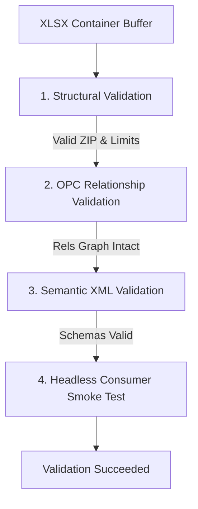

# @berryn/xlsx-validate

> **Multi-layer validation harness: Structural, OPC Relationship, Semantic XML, and Consumer Smoke tests.**

[](https://www.npmjs.com/package/@berryn/xlsx-validate)
[](https://opensource.org/licenses/MIT)
[](https://nodejs.org)
[](https://www.typescriptlang.org/)

---

## Overview

`@berryn/xlsx-validate` executes rigorous, multi-stage verification against generated or migrated XLSX spreadsheet workbooks. It catches corrupt files, broken Open Packaging Conventions (OPC) relationship references, invalid XML payloads, and headless consumer repair prompts before artifacts reach production.

---

## Installation

```bash
# Using pnpm
pnpm add @berryn/xlsx-validate

# Using npm
npm install @berryn/xlsx-validate
```

---

## The 4 Validation Layers



1. **Stage 1: Structural Integrity (`validateStructuralIntegrity`)**:
   - Decompresses archive under strict resource limit checks.
   - Asserts valid ZIP headers, non-zero file contents, and safe compression ratios (`BRN-VAL-001`).

2. **Stage 2: OPC Relationship Integrity (`validateRelationshipIntegrity`)**:
   - Parses `_rels/.rels` and part-specific `.rels` files.
   - Asserts all declared internal Relationship `Target` URIs exist physically within the container (`BRN-VAL-002`).

3. **Stage 3: Semantic XML Validation (`validateSemanticContents`)**:
   - Ensures core XML parts (`xl/workbook.xml`, `xl/styles.xml`, `xl/worksheets/sheet*.xml`) conform to OOXML expectations.

4. **Stage 4: Headless Consumer Smoke Test (`runConsumerSmokeTest`)**:
   - Optionally runs headless LibreOffice conversion in an isolated sandbox to detect real-world repair alerts (`BRN-VAL-003`).

---

## Usage Examples

### 1. Structural Validation

```typescript
import { readFileSync } from 'node:fs';
import { validateStructuralIntegrity } from '@berryn/xlsx-validate';

const buffer = readFileSync('workbook.xlsx');
const result = validateStructuralIntegrity(buffer);

console.log(`Passed: ${result.passed}`);
for (const diag of result.diagnostics) {
  console.log(`[${diag.severity}] ${diag.code}: ${diag.message}`);
}
```

---

### 2. OPC Relationship Validation

```typescript
import { validateRelationshipIntegrity } from '@berryn/xlsx-validate';

const relsResult = validateRelationshipIntegrity(buffer);

if (!relsResult.passed) {
  console.error('Workbook contains dangling or broken OPC relationships:');
  for (const diag of relsResult.diagnostics) {
    console.error(`- ${diag.message}`);
  }
}
```

---

### 3. Headless Consumer Smoke Test

```typescript
import { runConsumerSmokeTest } from '@berryn/xlsx-validate';

const smokeResult = runConsumerSmokeTest('/path/to/workbook.xlsx');
console.log(`Consumer Smoke Status: ${smokeResult.passed ? 'PASSED' : 'REPAIR_TRIGGERED'}`);
```

---

## Exported Symbols

| Symbol | Type | Description |
|---|---|---|
| `validateStructuralIntegrity` | Function | Verifies container decompression, entry existence, and safety limits. |
| `validateRelationshipIntegrity` | Function | Ensures all internal OPC relationship references resolve to actual container parts. |
| `validateSemanticContents` | Function | Checks XML payload integrity and workbook structure. |
| `runConsumerSmokeTest` | Function | Executes headless LibreOffice conversion to verify client compatibility. |
| `ValidationStageResult` | Interface | Result schema containing `passed`, `stageName`, and `diagnostics`. |

---

## Links

- **Repository**: [https://github.com/Grevix/berryn](https://github.com/Grevix/berryn)
- **License**: [MIT](https://opensource.org/licenses/MIT) © 2026 Berryn Core Engineering Team
